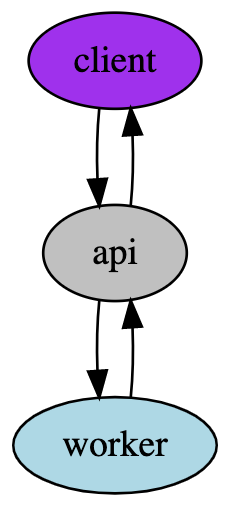

# Messaging

Imagine a system which has three tiers to it. Each tier is only allowed to talk to tier directly above or below it, and looks something like this:

The top level tier are the *Mobile Clients*. It is allowed to talk only to the *API* services through a RESTful HTTP/1.1 interface. The *API* can communicate with some *Workers* that do longer lived tasks. In order to keep all of the services loosely coupled and clean, a few design decisions have been made:

* The *API* may not do any processing of any sort. It can only communicate with the *Client* and dispatch work to the *Workers*.
* Communication between the *API* and the *Workers* must be done through some sort of asynchronous messaging service.
* The *Workers* are expected to reply to the *API* with an asynchronous message.
* The *API* should wait for the asynchronous reply from the *Workers* before replying to the *Clients*.

## Exercise

Our chosen cloud computing platform is AWS.  Given these constraints, what services, platforms, or patterns would you use to facilitate the asynchronous messaging between the *API* and the *Workers*? What are some advantages and drawbacks of your choices?

### Extra Credit

Provide either pseudocode or a working prototype to demonstrate your proposed solutions.  This should cover both the *API* and *Worker* roles on how they might initialize, communicate, and tear down communications between each other.

### Submission Instructions

The proposal should be written in markdown and submitted either via a GitHub repository or a Gist.  If you're providing the extra credit portion, a repository is preferred.  Respond to the email invitation to this exercise with a link to your work.
